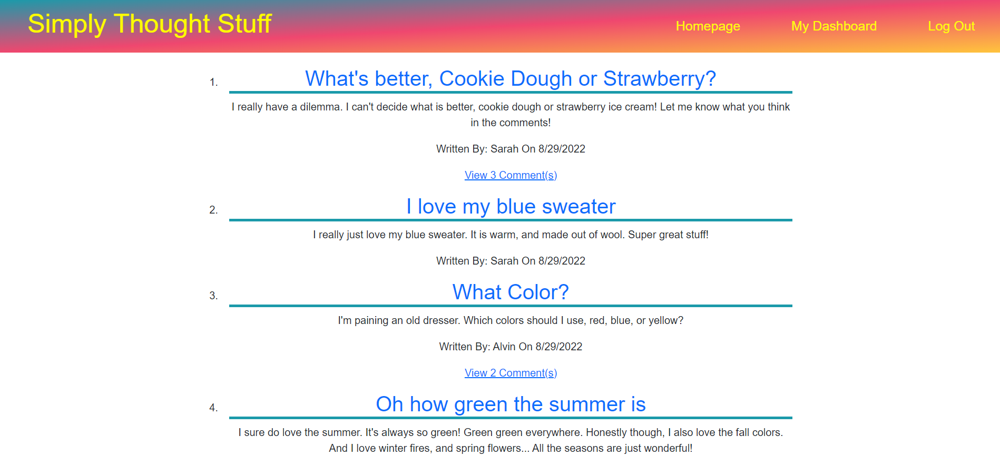
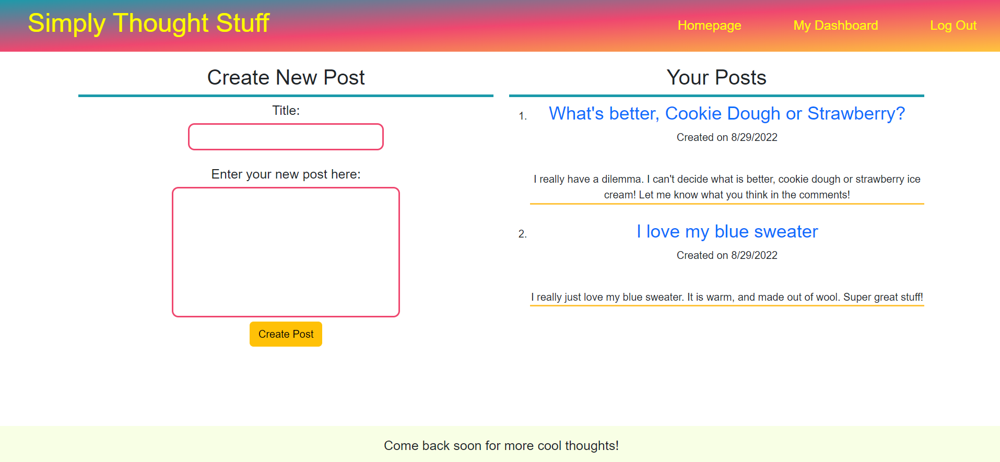
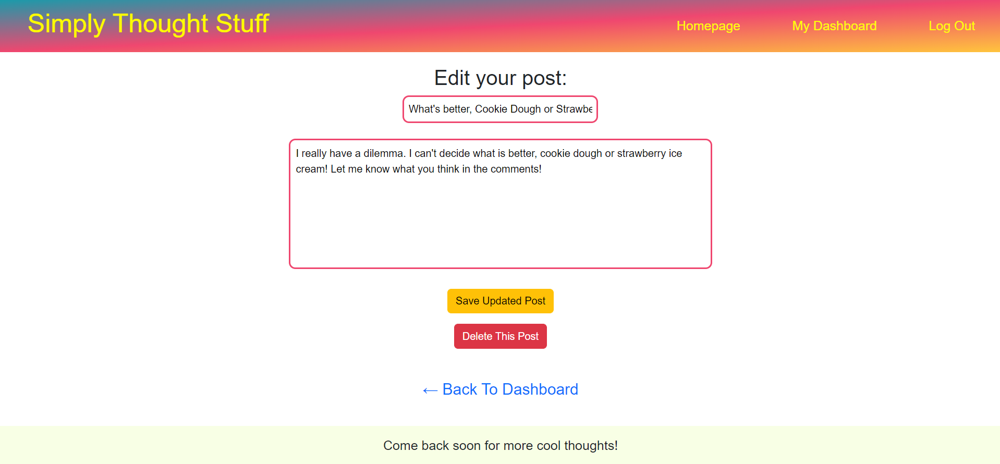
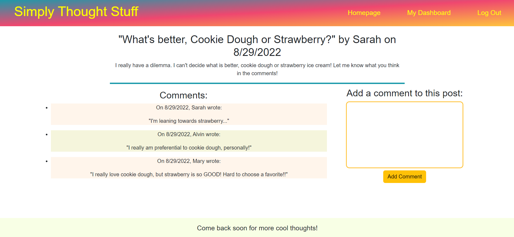

# Simply Thought Stuff

## Description

Simply Thought Stuff is a simple blog where users can view posts, make new posts, comment on and vote on posts. Made for anyone to be able to share their thoughts! The sky is the limit.

## Usage

The application is deployed on heroku at this address: 

https://fast-island-88973.herokuapp.com/

Here are some screenshots of the deployed application:

## Built With
* Javascript
* CSS
* express-handlebars
* bcrypt
* connect-session-sequelize
* express
* express-session
* mysql2
* sequelize

## Contributing
Made by Samuel Varney

